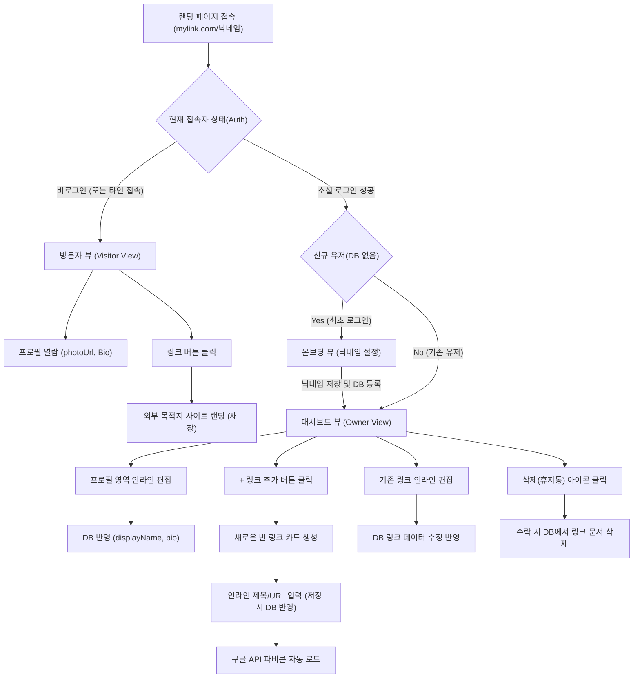

# 마이링크 (MyLink) - 와이어프레임 (Wireframes)

이 문서는 마이링크 서비스의 주요 화면(방문자 뷰 및 소유자 대시보드)에 대한 구조와 사용자 경험(UX) 흐름을 정의합니다.

---

## 1. 방문자 뷰 (Visitor View) - 랜딩 페이지

방문자가 `mylink.com/닉네임` 으로 접속했을 때 모바일(혹은 데스크탑)에서 보여지는 화면 구조입니다.

### 1.1 ASCII 아트 와이어프레임

```text
+-------------------------------------------------+
|                                                 |
|                 [ Share ]                       |
|                                                 |
|               .-----------.                     |
|              /             \                    |
|             |  [photoUrl]   |                   |
|              \             /                    |
|               '-----------'                     |
|                                                 |
|              @displayName                       |
|       "프리랜서 디자이너 홍길동입니다."         |
|                                                 |
|  +-------------------------------------------+  |
|  | [G]  내 포트폴리오 웹사이트               |  |
|  +-------------------------------------------+  |
|                                                 |
|  +-------------------------------------------+  |
|  | [I]  인스타그램 구경가기                  |  |
|  +-------------------------------------------+  |
|                                                 |
|  +-------------------------------------------+  |
|  | [Y]  유튜브 채널 구독                     |  |
|  +-------------------------------------------+  |
|                                                 |
|                                                 |
|              Powered by MyLink                  |
+-------------------------------------------------+
```
> `[G]`, `[I]`, `[Y]` 등은 구글 API를 통해 추출된 파비콘(Favicon) 영역을 의미합니다.


### 1.2 화면 구성 요소 설명
- **Share**: 페이지 URL을 다른 곳으로 쉽게 복사하거나 공유할 수 있는 시스템 버튼
- **아바타 (photoUrl)**: 구글 소셜 로그인 연동을 통해 얻어온 둥근 프로필 이미지
- **디스플레이 네임 (displayName)**: 사용자가 설정한 고유 닉네임
- **소개글 (Bio)**: 80자 내외의 소개 텍스트
- **링크 리스트**: 파비콘 + 텍스트 제목 형태의 클릭 가능한 버튼들. 텍스트는 가운데 정렬 혹은 좌측 정렬(아이콘 기준)

---

## 1.5 온보딩 뷰 (Onboarding View) - 신규 계정 설정

소셜 로그인 이후 최초 가입자인 경우, 마이링크에서 사용할 닉네임을 설정하기 위해 진입하는 화면입니다.

### 1.5.1 ASCII 아트 와이어프레임

```text
+-------------------------------------------------+
| MyLink                                          |
+-------------------------------------------------+
|                                                 |
|                                                 |
|             환영합니다! 🎉                      |
|      나만의 공식 링크 페이지를 시작해보세요.    |
|                                                 |
|                                                 |
|   [사용할 닉네임 (URL로 사용됨)             ]   |
|   * mylink.com/입력하신닉네임 형태로 열립니다.  |
|                                                 |
|   [     내 마이링크 시작하기 ->     ]           |
|                                                 |
|                                                 |
|                                                 |
+-------------------------------------------------+
```

### 1.5.2 화면 구성 요소 설명
- **닉네임 입력 폼**: 사용자 페이지의 고유 URL이 될 영문/숫자 형태의 닉네임을 입력.
- **시작하기 버튼**: 클릭 시 지정한 닉네임으로 `users` 컬렉션에 프로필 정보가 최종 등록되며 소유자 대시보드로 이동함.

---

## 2. 소유자 뷰 (Owner Dashboard) - 관리자/편집 페이지

소유자가 구글 계정으로 로그인한 상태일 때 보여지는 대시보드 화면입니다. **인라인 편집(Inline Edit)** 시스템을 사용합니다.

### 2.1 ASCII 아트 와이어프레임

```text
+-------------------------------------------------+
| MyLink                         [로그아웃]       |
+-------------------------------------------------+
|                                                 |
|               .-----------.                     |
|              /             \                    |
|             |  [photoUrl]   |                   |
|              \             /                    |
|               '-----------'                     |
|                                                 |
|              @displayName  ✏️                   |
|       "소개글을 입력해보세요." ✏️               |
|                                                 |
|  =============================================  |
|                                                 |
|  [ + 새 링크 추가하기 ]                         |
|                                                 |
|  +-------------------------------------------+  |
|  | [G] [제목 수정 가능 텍스트 영역        ]✏️|  |
|  |         [URL 주소 수정 가능 영역       ]✏️|  |
|  |                            [🗑️ 휴지통]    |  |
|  +-------------------------------------------+  |
|                                                 |
|  +-------------------------------------------+  |
|  | [N] [새로운 링크 제목                  ]✏️|  |
|  |         [https://new-url.com           ]✏️|  |
|  |                            [🗑️ 휴지통]    |  |
|  +-------------------------------------------+  |
|                                                 |
+-------------------------------------------------+
```

### 2.2 화면 구성 요소 설명
- **인라인 편집 (Inline Edit) ✏️**: `displayName`, 소개글, 링크 제목, 링크 URL 영역을 클릭하면 커서가 활성화되어 그 자리에서 타이핑하여 즉시 수정 가능
- **+ 새 링크 추가하기**: 버튼 클릭 시 아래 목록 최상단(혹은 하단)에 빈 링크 카드가 생성되며 즉시 텍스트 입력 대기 상태로 전환
- **휴지통 (Delete)**: 해당 링크를 완전히 삭제하기 위한 버튼

---

## 3. 페이지 간 사용자 흐름 (Mermaid Flowchart)

마이링크 생태계에서 일어나는 주요 뷰포트 진입 및 액션 데이터 플로우입니다.



---
> **디자인 시스템 (shadcn/ui)** 참고: 
> 본 와이어프레임 구조는 추후 Tailwind CSS와 shadcn/ui 컴포넌트(Card, Button, Dialog 등)를 조합하여 브라우저에서 모바일 퍼스트(Mobile-First) 디자인으로 반응형 렌더링 됩니다.
